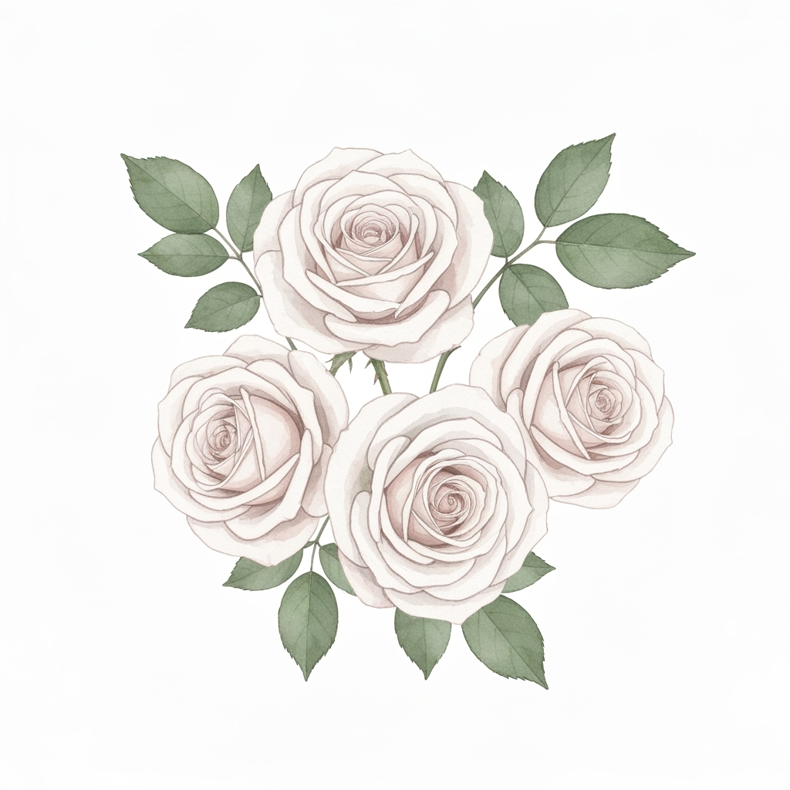
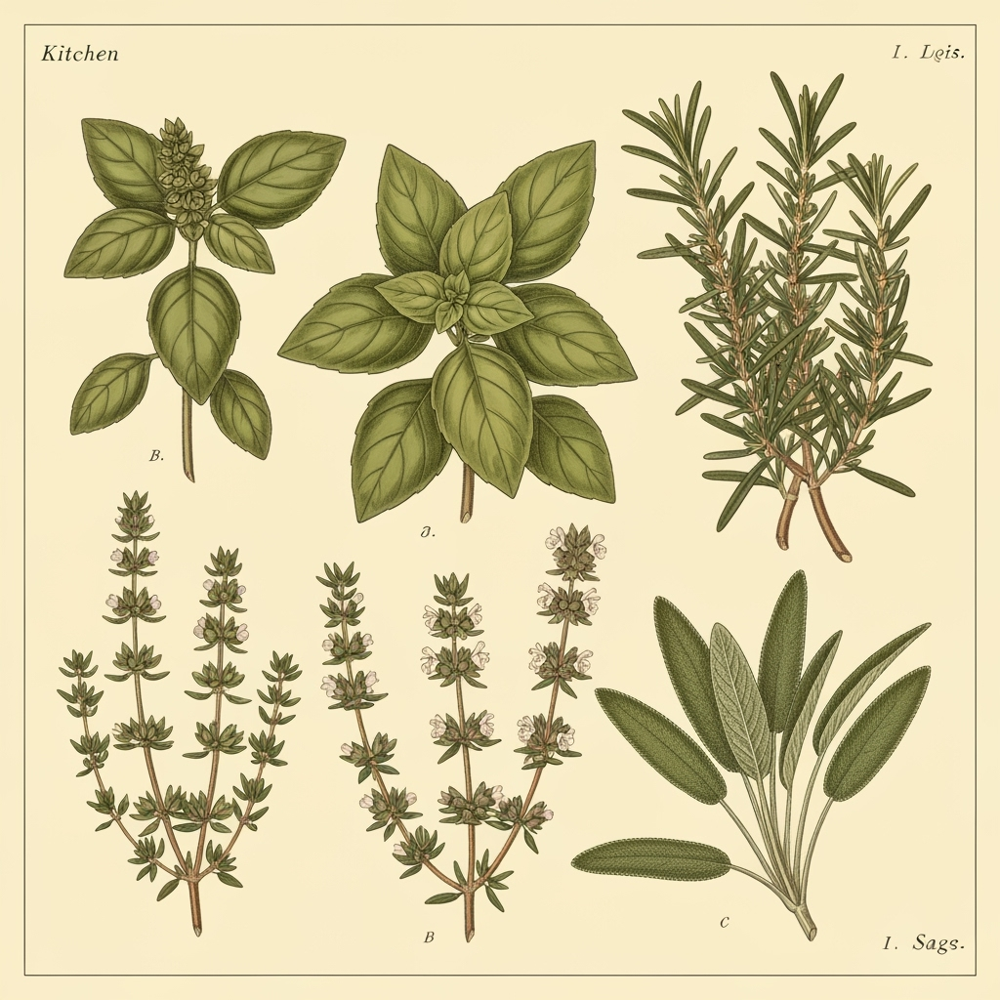

# ボタニカル柄コレクション - 春夏 2026

> 自然の美しさをファッションに

## パターン一覧

| Pattern ID | パターン名 | プレビュー | カラーチップ | スケール | スタイル | 説明 |
|------------|------------|------------|--------------|----------|----------|------|
| #001 | **ホワイトローズガーデン** |  |  | Large | エレガント・ロマンティック・水彩風・オーガニック | エレガントな白いバラと柔らかな緑の葉を水彩風で表現。ロマンティックな植物イラストレーションで、自然で有機的な配置が特徴の夢のような雰囲気のデザイン |
| #002 | **トロピカルリーフ** |  |  | Medium | モダン・トロピカル・ミニマル・フレッシュ | 鮮やかな緑のトロピカルなヤシの葉とモンステラ植物の植物パターン。モダンでミニマリストなスタイルで、クリーンなラインと現代的なデザインが夏の爽やかさを演出 |
| #003 | **ワイルドフラワーメドウ** |  |  | Small | ヴィンテージ・ナチュラル・手描き風・カジュアル | デイジー、コーンフラワー、ポピーなどの野生の草花を散りばめた自然な配置。ヴィンテージ植物イラストスタイルで手描きの美学を表現し、陽気な春の気分を演出 |
| #004 | **ユーカリブランチ** |  |  | Large | スカンジナビアン・ソフィスティケート・ミニマル・モノトーン | シルバーグリーンの葉を持つユーカリの枝をミニマリスト植物デザインで表現。モダンなスカンジナビアスタイルで、クリーンな幾何学的配置と洗練されたニュートラルトーン |
| #005 | **ハーブガーデン** |  |  | Medium | ヴィンテージ・教育的・詳細・アーシー | バジル、ローズマリー、タイム、セージなどのキッチンハーブを詳細な植物イラストで表現。教育的なヴィンテージスタイルで、精密な線画と自然なアーシーカラー |

## カラーパレット詳細

### Pattern #001 - ホワイトローズガーデン
- **プライマリ**: `#F8F8F8`
- **セカンダリ**: `#E8F5E8`, `#F0F0F0`, `#D4E6D4`

### Pattern #002 - トロピカルリーフ
- **プライマリ**: `#228B22`
- **セカンダリ**: `#32CD32`, `#90EE90`, `#006400`

### Pattern #003 - ワイルドフラワーメドウ
- **プライマリ**: `#FF69B4`
- **セカンダリ**: `#87CEEB`, `#FFD700`, `#98FB98`

### Pattern #004 - ユーカリブランチ
- **プライマリ**: `#B2C5B2`
- **セカンダリ**: `#D3D3D3`, `#F5F5DC`, `#778B77`

### Pattern #005 - ハーブガーデン
- **プライマリ**: `#556B2F`
- **セカンダリ**: `#9ACD32`, `#8FBC8F`, `#6B8E23`

## 技術仕様

### スケール分類
- **Large**: インパクトのあるメインデザインとして使用
- **Medium**: バランスの取れた汎用性の高いサイズ
- **Small**: アクセントや総柄として活用

### スタイル組み合わせ戦略
1. **エレガント × ロマンティック** - 上品で女性らしいデザイン
2. **モダン × ミニマル** - 現代的でシンプルなアプローチ
3. **ヴィンテージ × ナチュラル** - レトロで自然な魅力

## 適用例

### アパレル
- ブラウス
- ワンピース  
- スカート
- カジュアルウェア

### ホームテキスタイル
- カーテン
- クッション
- テーブルクロス
- ベッドリネン

### アクセサリー
- スカーフ
- バッグ
- ポーチ
- ハンカチ

## カラーパレット戦略

### プライマリテーマ
- ナチュラルグリーン
- ソフトピンク
- クリーンホワイト
- アーシートーン

### シーズナル考慮
春夏の軽やかさを表現する明るく爽やかな色調

### マーケットポジショニング
幅広い年齢層に対応する上品でトレンド感のあるカラーリング

---

*このカタログは春夏2026コレクション用に作成されました。各パターンの詳細な技術仕様については、併せて提供される `catalog-data.yaml` ファイルをご参照ください。*