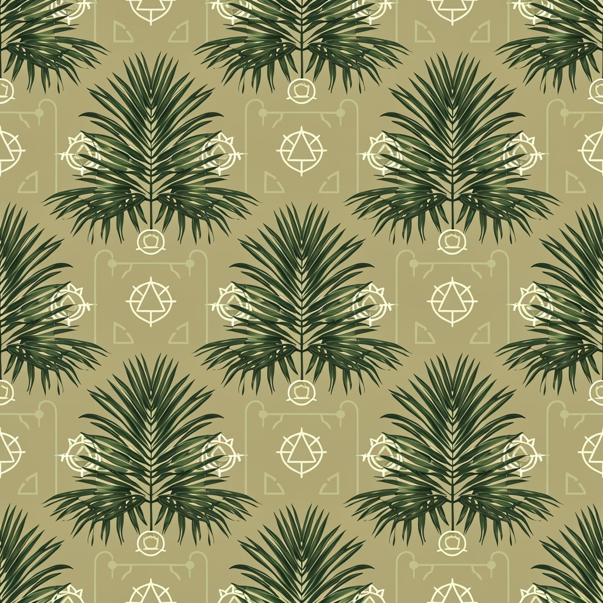
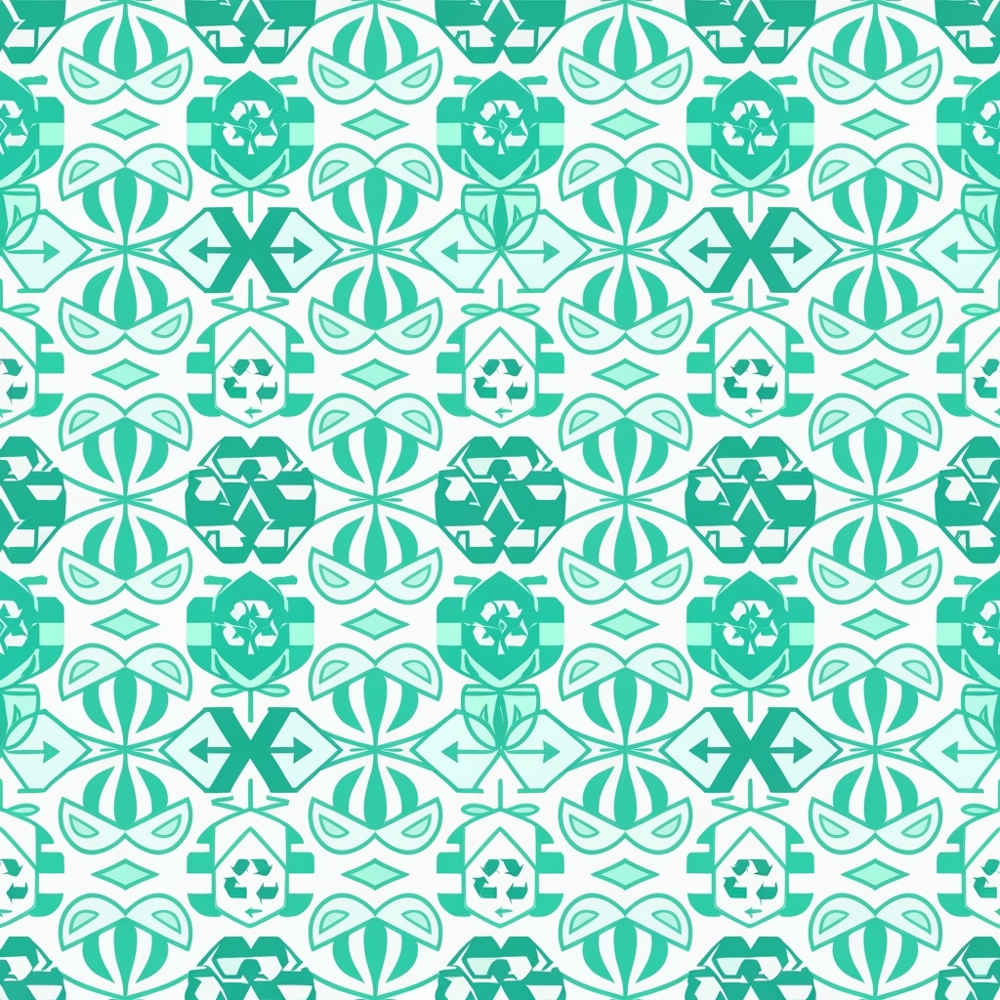
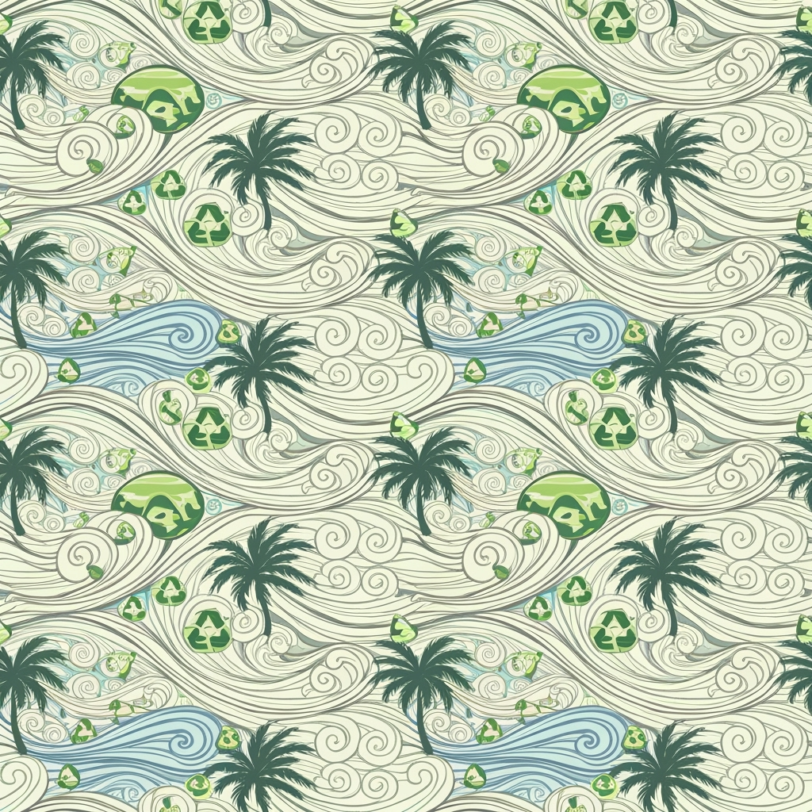
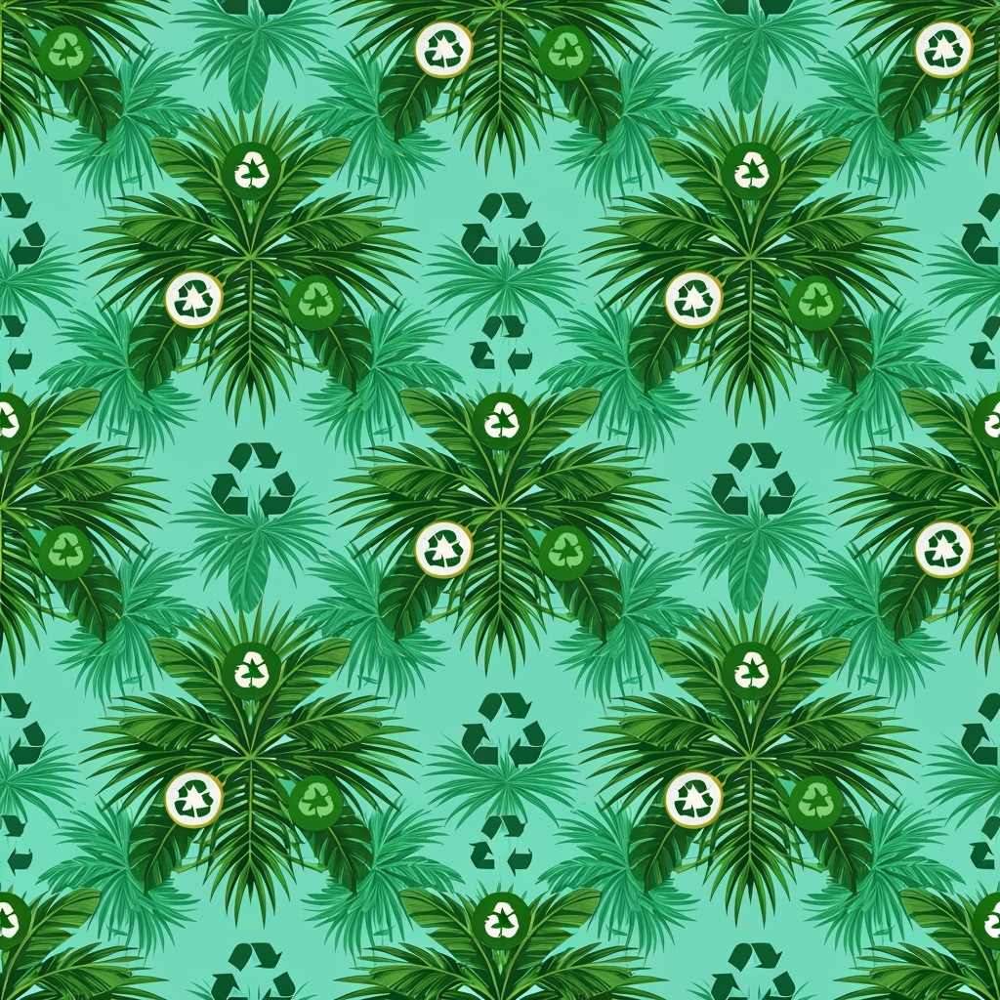
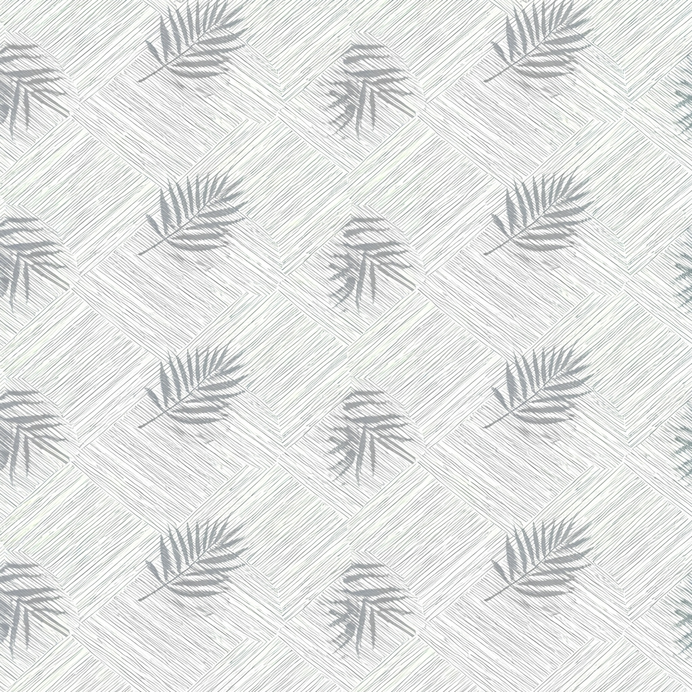

# エコ・パームクール2026SS ファッションカタログ

**2026年 春夏コレクション** | **Eco Palm Cool テーマ**

---

## パターンカタログ

| パターン | 画像プレビュー | 詳細情報 | カラーパレット |
|---------|-------------|---------|--------------|
| **01 トロピカルパーム**<br/>Pattern ID: 01 |  | **リピートタイプ:** ハーフドロップ<br/>**スケール:** ラージ<br/>**用途:** テキスタイル、ボタニカル<br/>**スタイル:** エコフレンドリー | **プライマリ:** `#2D5A3D` <br/>**セカンダリ:** `#7FB069` `#A8E6A3` `#E8F5E8` `#4A7C59` |
| **02 クールリーフジオメトリー**<br/>Pattern ID: 02 |  | **リピートタイプ:** ストレート<br/>**スケール:** ミディアム<br/>**用途:** ジオメトリック、テキスタイル<br/>**スタイル:** コンテンポラリー | **プライマリ:** `#1B4D3E` <br/>**セカンダリ:** `#66C2A5` `#B2DF8A` `#F0F8F0` `#3D8B73` |
| **03 エコウィンドパターン**<br/>Pattern ID: 03 |  | **リピートタイプ:** ブリック<br/>**スケール:** ミディアム<br/>**用途:** アブストラクト、フローイング<br/>**スタイル:** テキスタイル | **プライマリ:** `#4A8B6F` <br/>**セカンダリ:** `#8FBC8F` `#C1E1C1` `#F5FFF5` `#2E7D5A` |
| **04 サステナブルトロピック**<br/>Pattern ID: 04 |  | **リピートタイプ:** ハーフドロップ<br/>**スケール:** ラージ<br/>**用途:** トロピカル、サステナブル<br/>**スタイル:** テキスタイル | **プライマリ:** `#355E3B` <br/>**セカンダリ:** `#90EE90` `#ADDFAD` `#F0FFF0` `#50C878` |
| **05 クールブリーズミニマル**<br/>Pattern ID: 05 |  | **リピートタイプ:** ストレート<br/>**スケール:** スモール<br/>**用途:** ミニマル、リニア<br/>**スタイル:** テキスタイル | **プライマリ:** `#2F5F4F` <br/>**セカンダリ:** `#98FB98` `#C0FFC0` `#F8FFF8` `#6B8E6B` |

---

## 技術仕様

### パターン要件
- **リピート要件:** すべてのパターンは完璧にタイル表示され、継ぎ目が見えないこと
- **カラーマッチング:** 生産用にPantoneカラーマッチングが必要
- **生地適合性:** コットン、リネン、エコフレンドリー合成繊維ブレンドに最適化
- **印刷方法:** デジタルテキスタイル印刷を推奨

### カラーコード詳細

#### パターン01 - トロピカルパーム
- **プライマリカラー:** `#2D5A3D` (ダークグリーン)
- **セカンダリカラー:** 
  - `#7FB069` (ライトグリーン)
  - `#A8E6A3` (ペールグリーン)  
  - `#E8F5E8` (ベリーペールグリーン)
  - `#4A7C59` (ミディアムグリーン)

#### パターン02 - クールリーフジオメトリー
- **プライマリカラー:** `#1B4D3E` (ダークティール)
- **セカンダリカラー:**
  - `#66C2A5` (ティール)
  - `#B2DF8A` (ライトグリーン)
  - `#F0F8F0` (オフホワイトグリーン)
  - `#3D8B73` (ミディアムティール)

#### パターン03 - エコウィンドパターン
- **プライマリカラー:** `#4A8B6F` (ジェイドグリーン)
- **セカンダリカラー:**
  - `#8FBC8F` (ダークシーグリーン)
  - `#C1E1C1` (ライトグリーン)
  - `#F5FFF5` (ミントクリーム)
  - `#2E7D5A` (フォレストグリーン)

#### パターン04 - サステナブルトロピック
- **プライマリカラー:** `#355E3B` (ハンターグリーン)
- **セカンダリカラー:**
  - `#90EE90` (ライトグリーン)
  - `#ADDFAD` (ペールグリーン)
  - `#F0FFF0` (ハニーデュー)
  - `#50C878` (エメラルドグリーン)

#### パターン05 - クールブリーズミニマル
- **プライマリカラー:** `#2F5F4F` (ダークスレートグレー)
- **セカンダリカラー:**
  - `#98FB98` (ペールグリーン)
  - `#C0FFC0` (ライトグリーン)
  - `#F8FFF8` (ゴーストホワイト)
  - `#6B8E6B` (ダークオリーブグリーン)

---

## ファイル構成

```
print-16542103933/
├── catalog.html          # フルデザイン版カタログ
├── catalog.md            # GitHub表示用カタログ (このファイル)
├── catalog-data.yaml     # 編集可能なデータファイル
├── pattern-specs.json    # パターン仕様データ
├── patterns/            # パターン画像
│   ├── pattern_1.png
│   ├── pattern_2.png
│   ├── pattern_3.png
│   ├── pattern_4.png
│   └── pattern_5.png
└── colors/              # カラーチップ画像
    ├── chip_1.png
    ├── chip_2.png
    ├── chip_3.png
    ├── chip_4.png
    └── chip_5.png
```

---

*このカタログは2026年春夏エコ・パームクールコレクションの公式ドキュメントです。*