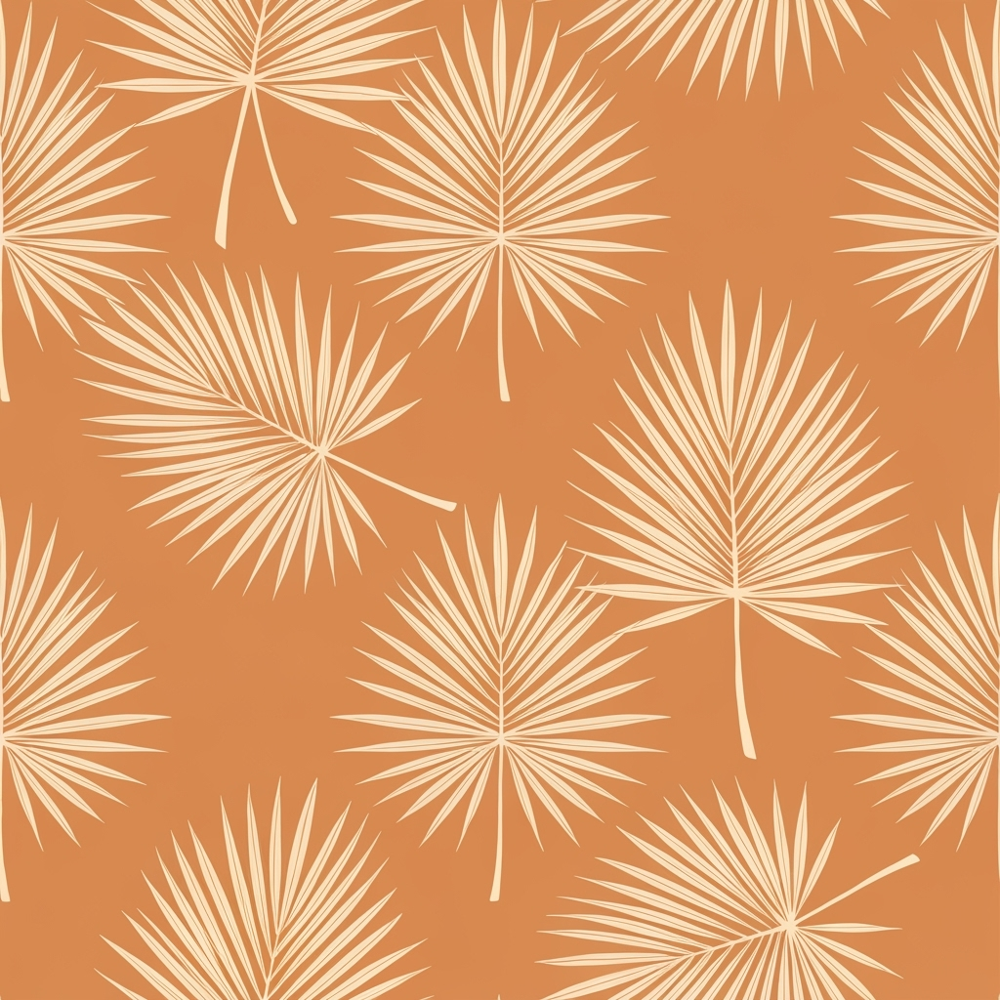
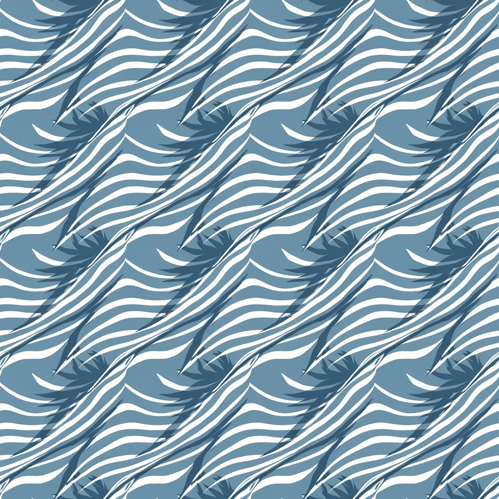
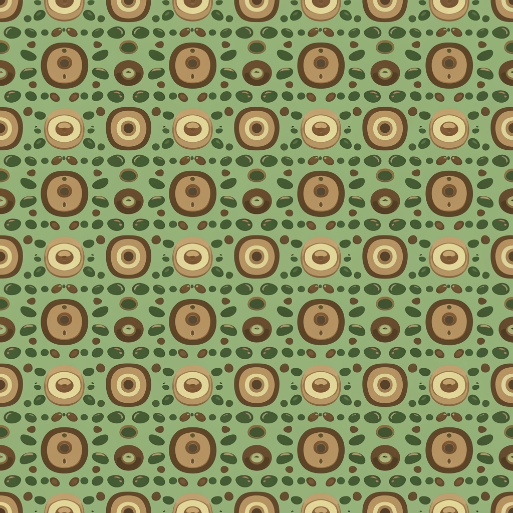
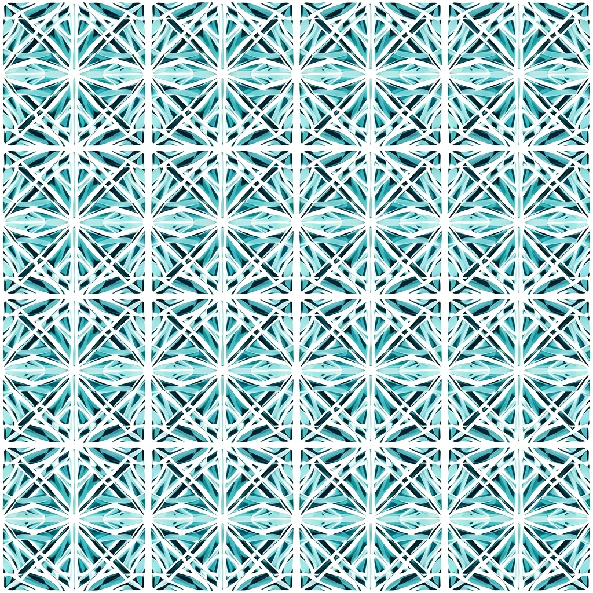

# エコ・パームクール - 2026春夏コレクション

**プロフェッショナル ファッションカタログ**

---

## パターンコレクション

### 1. エコパーム・リーフ

| 画像 | 詳細情報 |
|------|----------|
|  | **パターン名:** エコパーム・リーフ<br>**説明:** 持続可能なスタイルでデザインされたパームリーフとトロピカルフロンドのシームレスなリピートパターン。オーガニックで自然な質感を持つボタニカルイラストレーションスタイル。<br><br>**技術仕様:**<br>• リピートタイプ: ハーフドロップ<br>• スケール: ラージ<br>• 用途: テキスタイル・ボタニカル・エコ<br><br>**カラーパレット:**<br>🎨 Primary: `#2D5D2F` <br>🎨 `#7FB069` <br>🎨 `#A8D5A8` <br>🎨 `#F4F9F4` <br>🎨 `#E8F5E8`  |

---

### 2. クールウィンド・ストライプ

| 画像 | 詳細情報 |
|------|----------|
|  | **パターン名:** クールウィンド・ストライプ<br>**説明:** パームシャドウ効果を持つクーリングウィンドストライプのシームレスリピートパターン。穏やかな風を示唆する流れるような線形要素とモダンミニマリストアプローチ。<br><br>**技術仕様:**<br>• リピートタイプ: ストレート<br>• スケール: ミディアム<br>• 用途: テキスタイル・リニア・クーリング<br><br>**カラーパレット:**<br>🎨 Primary: `#4A90A4` <br>🎨 `#87CEEB` <br>🎨 `#B8E6B8` <br>🎨 `#F0F8F0` <br>🎨 `#FFFFFF`  |

---

### 3. サステナブル・ドット

| 画像 | 詳細情報 |
|------|----------|
|  | **パターン名:** サステナブル・ドット<br>**説明:** パームシードと自然な形からインスピレーションを得たオーガニックな円形ドットのシームレスリピートパターン。エコ意識のあるスペーシングとバイオフィリックデザイン要素。<br><br>**技術仕様:**<br>• リピートタイプ: ブリック<br>• スケール: スモール<br>• 用途: テキスタイル・ジオメトリック・オーガニック<br><br>**カラーパレット:**<br>🎨 Primary: `#6B8E23` <br>🎨 `#9ACD32` <br>🎨 `#F5F5DC` <br>🎨 `#FFFAF0` <br>🎨 `#E6E6FA`  |

---

### 4. トロピカル・ウェーブ

| 画像 | 詳細情報 |
|------|----------|
|  | **パターン名:** トロピカル・ウェーブ<br>**説明:** パームツリーシルエットを持つ流れるようなウェーブパターンのシームレスリピートデザイン。海風とトロピカルな雰囲気を示唆する波形と流体的なオーガニックシェイプ。<br><br>**技術仕様:**<br>• リピートタイプ: ハーフドロップ<br>• スケール: ラージ<br>• 用途: テキスタイル・フローイング・トロピカル<br><br>**カラーパレット:**<br>🎨 Primary: `#008B8B` <br>🎨 `#20B2AA` <br>🎨 `#AFEEEE` <br>🎨 `#F0FFFF` <br>🎨 `#E0FFFF`  |

---

### 5. エアリー・メッシュ

| 画像 | 詳細情報 |
|------|----------|
|  | **パターン名:** エアリー・メッシュ<br>**説明:** パームファイバーからインスピレーションを得たエアリーメッシュ構造のシームレスリピートパターン。冷却換気を示唆する通気性のある幾何学的グリッドパターンと持続可能なテキスタイルコンセプト。<br><br>**技術仕様:**<br>• リピートタイプ: ストレート<br>• スケール: ミディアム<br>• 用途: テキスタイル・ジオメトリック・エアリー<br><br>**カラーパレット:**<br>🎨 Primary: `#778899` <br>🎨 `#B0C4DE` <br>🎨 `#E6F3FF` <br>🎨 `#F8F8FF` <br>🎨 `#FFFFFF`  |

---

## デザインノート

### 🌿 シーズンフォーカス
2026春夏の軽やかさと涼しさを重視

### ♻️ エコエレメント
持続可能性とパームモチーフの融合

### ❄️ クーリングファクター
視覚的涼感効果を全パターンに組み込み

### 🔄 リピートテクノロジー
シームレス・リピート技術により製造効率を最適化

---

## ファイル構成

```
print-16546267803/
├── catalog.html          # フルデザイン版カタログ
├── catalog.md            # GitHub表示用カタログ（このファイル）
├── catalog-data.yaml     # 編集可能なデータファイル
├── pattern-specs.json    # パターン仕様データ
├── patterns/             # パターン画像
│   ├── pattern_1.png
│   ├── pattern_2.png
│   ├── pattern_3.png
│   ├── pattern_4.png
│   └── pattern_5.png
└── colors/               # カラーチップ画像
    ├── chip_1.png
    ├── chip_2.png
    ├── chip_3.png
    ├── chip_4.png
    └── chip_5.png
```

---

*このカタログは2026春夏コレクション「エコ・パームクール」のプロフェッショナルファッションカタログです。*