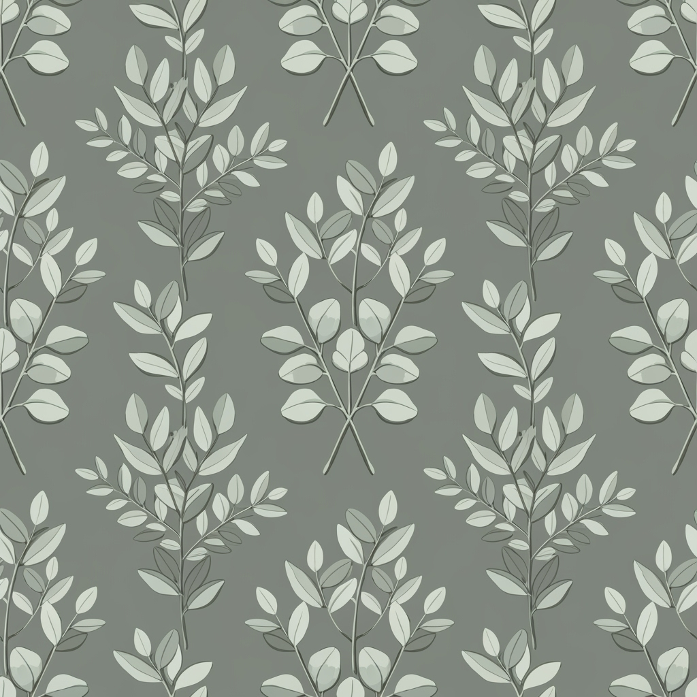

# Botanical Collection 2026 - Fashion Catalog

**Spring/Summer 2026 | プロフェッショナル ファッション カタログ**  
*シームレス リピート パターン | 植物テーマ | 5パターン*

---

## パターン一覧

| パターン | プレビュー | 詳細 | カラーパレット | 技術仕様 |
|----------|------------|------|----------------|----------|
| **Wild Meadow Florals** 野生の草花 |  | **リピート:** ハーフドロップ **スケール:** ミディアム **スタイル:** ボタニカル・オーガニック  野生の草花が織りなす繊細なパターン。タンポポ、ポピー、ヤグルマギクが自然な配置で散りばめられた、ボタニカルイラストスタイルの手描き風デザイン。 |  `#E8F5E8`  `#7FB069`  `#D4A574`  `#E07A5F`  `#81B29A`  `#F2CC8F` | • シームレス繰り返しパターン • タイル可能、連続モチーフ • 境界線なし、完全リピート • HEXカラーフォーマット |
| **Tropical Leaf Symphony** トロピカルリーフ |  | **リピート:** ブリック **スケール:** ラージ **スタイル:** トロピカル・コンテンポラリー  モンステラ、フィロデンドロン、ヤシの葉が重なり合う豊かなトロピカルパターン。リズミカルな構成で現代的なボタニカルスタイルを表現。 |  `#F7F9F7`  `#2D5016`  `#4A7C59`  `#8FBC8F`  `#228B22`  `#6B8E23` | • シームレス繰り返しパターン • タイル可能、連続モチーフ • 境界線なし、完全リピート • HEXカラーフォーマット |
| **Herb Garden Delight** ハーブガーデン |  | **リピート:** ストレート **スケール:** スモール **スタイル:** ハーバル・水彩  バジル、ローズマリー、タイム、ラベンダーなどの料理用ハーブを繊細な小枝で表現。水彩ボタニカルスタイルで新鮮なガーデンの美学を追求。 |  `#FEFEFE`  `#9CAF88`  `#C7B377`  `#8B7355`  `#A0522D`  `#556B2F` | • シームレス繰り返しパターン • タイル可能、連続モチーフ • 境界線なし、完全リピート • HEXカラーフォーマット |
| **Sakura Blossom Dance** 桜の舞 |  | **リピート:** ハーフドロップ **スケール:** ミディアム **スタイル:** ジャパニーズ・幻想的  桜の花びらが優雅に舞い踊る様子を表現した日本風インスパイアのボタニカルデザイン。春の祝祭を象徴する幻想的で軽やかなパターン。 |  `#FDF5F3`  `#FFB7C5`  `#FF69B4`  `#DA70D6`  `#B19CD9`  `#87CEEB` | • シームレス繰り返しパターン • タイル可能、連続モチーフ • 境界線なし、完全リピート • HEXカラーフォーマット |
| **Eucalyptus Grove** ユーカリの森 |  | **リピート:** ストレート **スケール:** ラージ **スタイル:** ミニマリスト・スカンジナビア  銀色の葉を持つユーカリの枝が幾何学的な自然パターンを作り出すミニマリストデザイン。現代的なスカンジナビア美学を体現した洗練されたボタニカルパターン。 |  `#F8F8FF`  `#B8C5B8`  `#8FBC8F`  `#98FB98`  `#90EE90`  `#E0E0E0` | • シームレス繰り返しパターン • タイル可能、連続モチーフ • 境界線なし、完全リピート • HEXカラーフォーマット |

---

## コレクション情報

- **年度:** 2026
- **シーズン:** Spring/Summer
- **テーマ:** Botanical (植物)
- **作成日:** 2025-07-27
- **フォーマット:** シームレスリピートパターン
- **カラーフォーマット:** HEX値
- **リピートオプション:** straight, half-drop, brick

---

## 技術仕様の詳細

### パターンの種類
- **straight (ストレート):** 単純な格子状の繰り返し
- **half-drop (ハーフドロップ):** 半分ずらした配置での繰り返し
- **brick (ブリック):** レンガ状の配置での繰り返し

### スケール
- **small (スモール):** 細かいパターン
- **medium (ミディアム):** 中間的なサイズ
- **large (ラージ):** 大きなパターン

### ファイル形式
- パターン画像: PNG形式
- カラーデータ: HEX値での指定
- 技術要件: タイル可能、境界線なし、完全リピート対応

---

*このカタログは、プロフェッショナルなファッション業界向けに作成された高品質なボタニカルパターンコレクションです。各パターンは厳密な技術仕様に基づいて制作されており、テキスタイル印刷に最適化されています。*