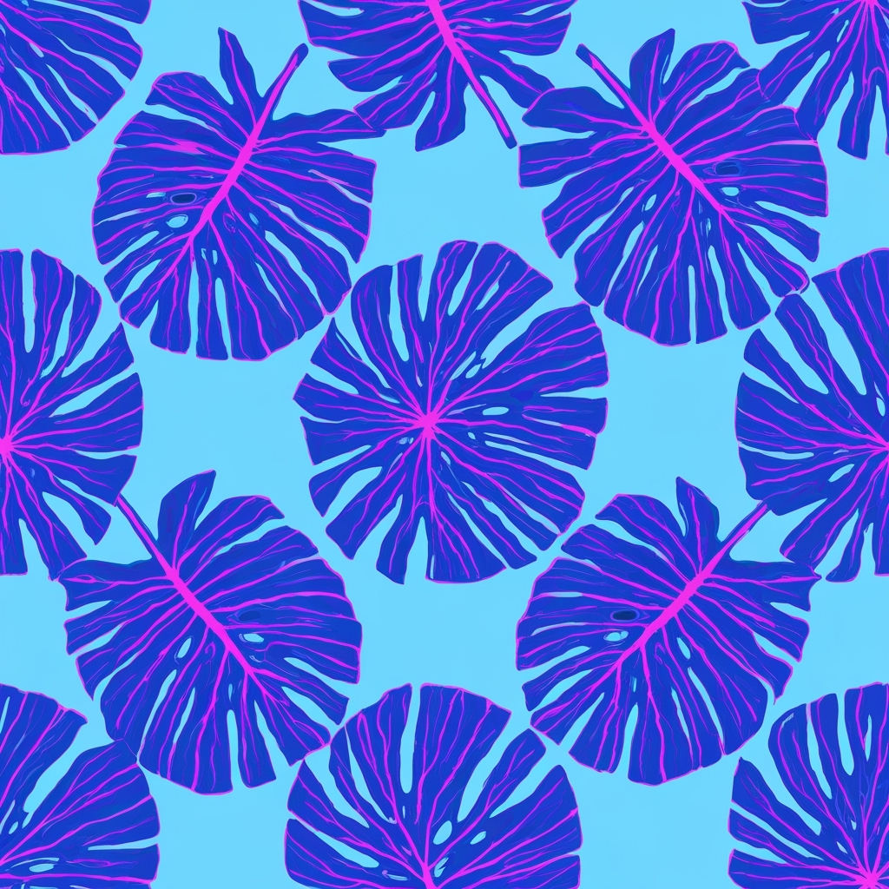
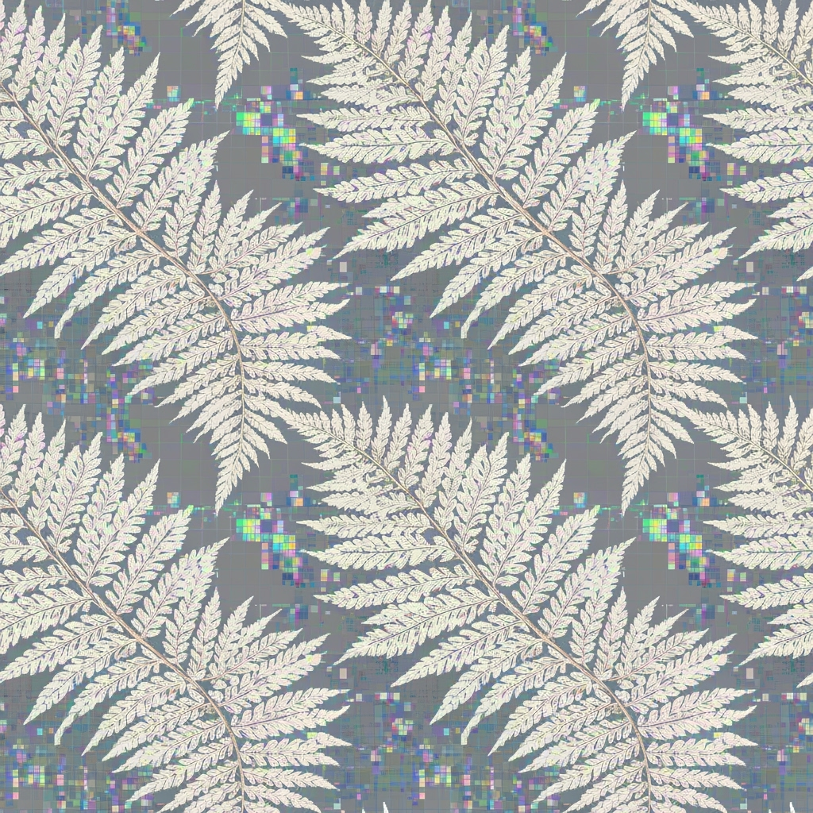
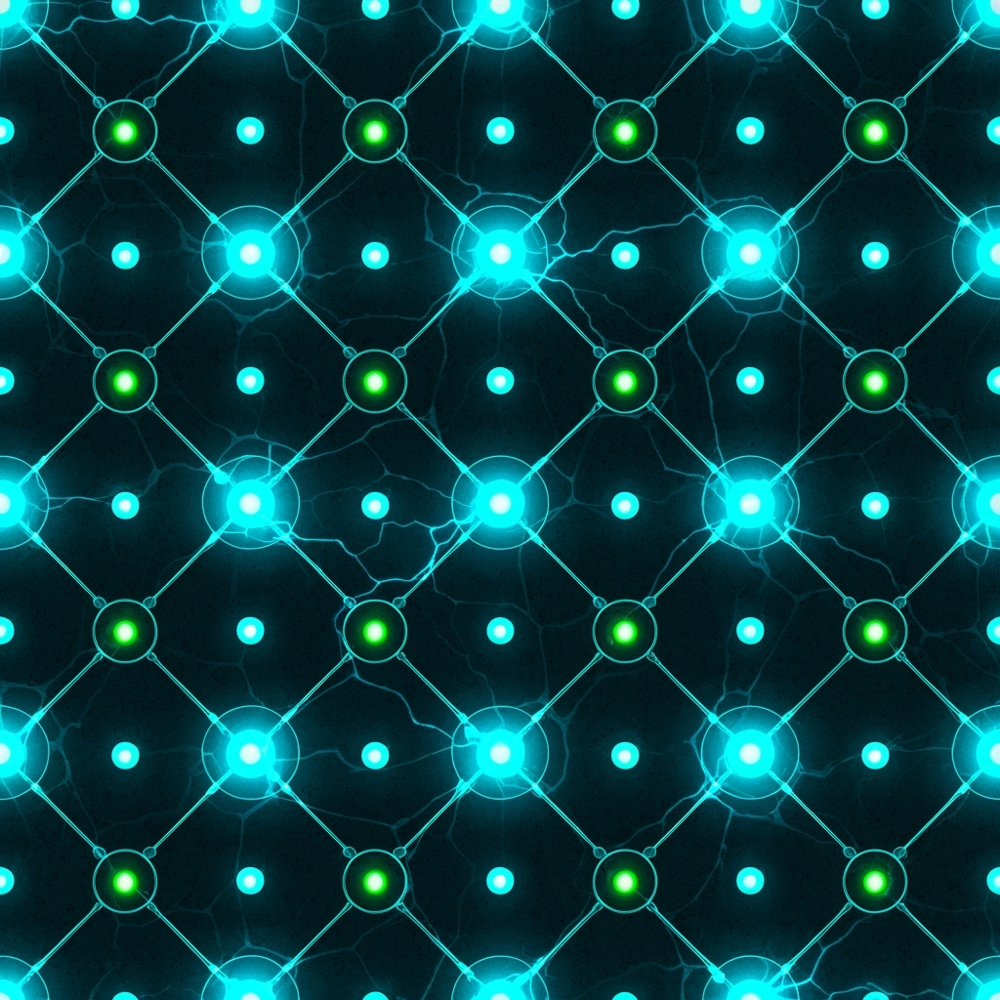
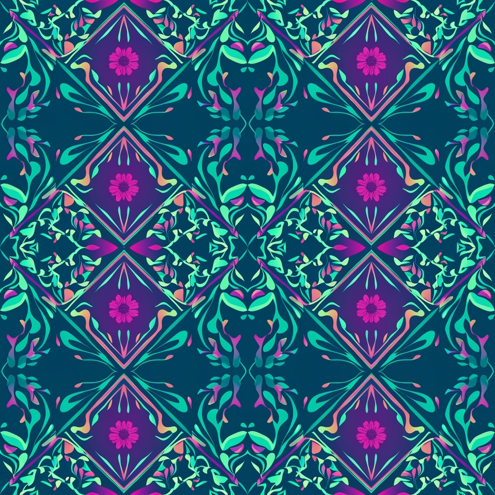
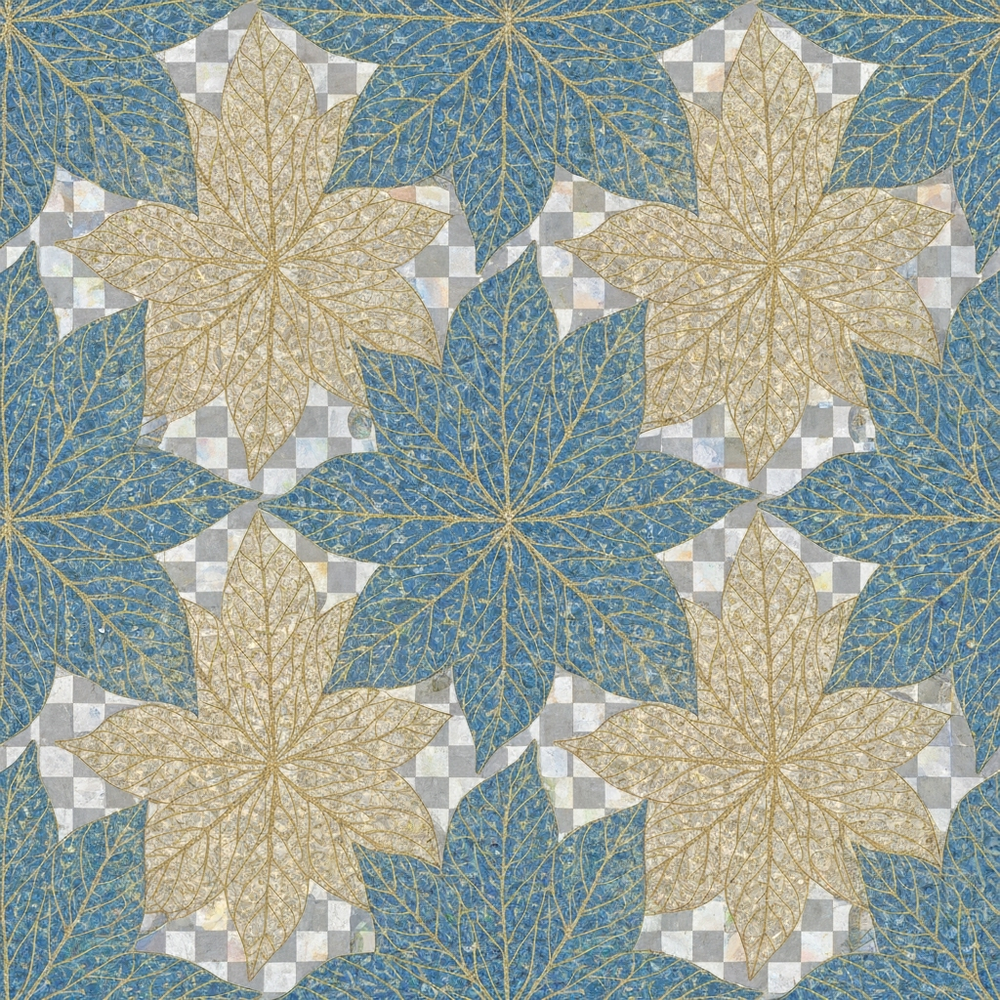

# Cyberbotanical Fashion Catalog 2026

**2026年春夏コレクション・プロフェッショナルファッションカタログ**  
Collection ID: PRINT-16702775433

---

## Pattern Collection Overview

| Pattern | Preview | Details | Color Palette |
|---------|---------|---------|---------------|
| **Digital Circuit Botanica** デジタル回路ボタニカ |  | **Scale:** Large **Repeat:** Half Drop **Use:** Statement pieces **Tech:** Glowing vein effects |  `#00FFFF`  `#FF1493`  `#32CD32`  `#1E1E1E`  `#C0C0C0` |
| **Holographic Fern Matrix** ホログラフィック・ファーン・マトリックス |  | **Scale:** Medium **Repeat:** Straight **Use:** Versatile garments **Tech:** Holographic printing |  `#9370DB`  `#00CED1`  `#FFB6C1`  `#E6E6FA`  `#483D8B` |
| **Bioluminescent Moss Network** バイオルミネセント・モス・ネットワーク |  | **Scale:** Small **Repeat:** Brick **Use:** Tech-wear **Tech:** Bio-luminescent effects |  `#32CD32`  `#00FFFF`  `#228B22`  `#2F4F4F`  `#F0FFFF` |
| **Cyber Bloom Transformation** サイバー・ブルーム・トランスフォーメーション |  | **Scale:** Large **Repeat:** Half Drop **Use:** Evolution theme **Tech:** Gradient transformation |  `#008B8B`  `#FF1493`  `#FF69B4`  `#4682B4`  `#F5F5DC` |
| **Quantum Leaf Circuitry** クォンタム・リーフ・サーキュイトリー |  | **Scale:** Medium **Repeat:** Straight **Use:** Transparency illusion **Tech:** Advanced printing |  `#4169E1`  `#FFC000`  `#E0FFFF`  `#191970`  `#FFFAF0` |

---

## 2026 Color Trend Analysis

### Primary Trend
- **Transformative Teal** (2026 Color of the Year)

### Supporting Palette
- Electric Fuchsia
- Blue Aura 
- Amber Haze
- Jelly Mint

### Technical Colors
- **Neon Cyan** - For digital elements
- **Metallic Silver** - For tech components  
- **Deep Purple** - For bioluminescence
- **Earthy Neutrals** - For botanical backgrounds

---

## Target Demographics

| Persona | Age Range | Characteristics |
|---------|-----------|-----------------|
| **Primary** | Gen Z (18-27) | Tech-savvy, sustainability-focused |
| **Secondary** | Millennials (28-43) | Environmental leaders, premium eco-conscious |
| **Tertiary** | Urban professionals | Seeking conversation-starter pieces |

---

## Production Specifications

- **Resolution:** 6000x6000 pixels minimum
- **Format:** Vector-based with layered PSD
- **DPI:** 2400 DPI for commercial licensing
- **Repeat Accuracy:** Perfect mathematical tiling required

### Special Effects Capabilities
- ✨ Holographic printing capability
- 🧬 Bioluminescent material integration  
- 🌈 UV-reactive color changing elements
- 💧 Moisture-responsive technology compatibility

---

## Pattern Details

### 1. Digital Circuit Botanica (デジタル回路ボタニカ)
**Theme:** Electric botanical with circuit board veins  
**Application:** Statement pieces, oversized scale garments  
**Special Features:** Glowing vein effects, high-contrast electric theme

### 2. Holographic Fern Matrix (ホログラフィック・ファーン・マトリックス)  
**Theme:** Fern fronds with holographic data streams  
**Application:** Versatile garment applications  
**Special Features:** Pixelated edges, glitch effects, iridescent color shifts

### 3. Bioluminescent Moss Network (バイオルミネセント・モス・ネットワーク)
**Theme:** Organic moss with LED-like nodes  
**Application:** Tech-wear, performance garments  
**Special Features:** Network connection lines, glowing points

### 4. Cyber Bloom Transformation (サイバー・ブルーム・トランスフォーメーション)
**Theme:** Plants morphing into digital forms  
**Application:** Evolution-themed collections  
**Special Features:** Gradient transformation effects, nature-tech fusion

### 5. Quantum Leaf Circuitry (クォンタム・リーフ・サーキュイトリー)
**Theme:** Translucent leaves with microchip patterns  
**Application:** Premium transparent effect garments  
**Special Features:** Quantum particle effects, ethereal transparency

---

*Collection ID: PRINT-16702775433 | Generated for 2026 Spring/Summer Season*