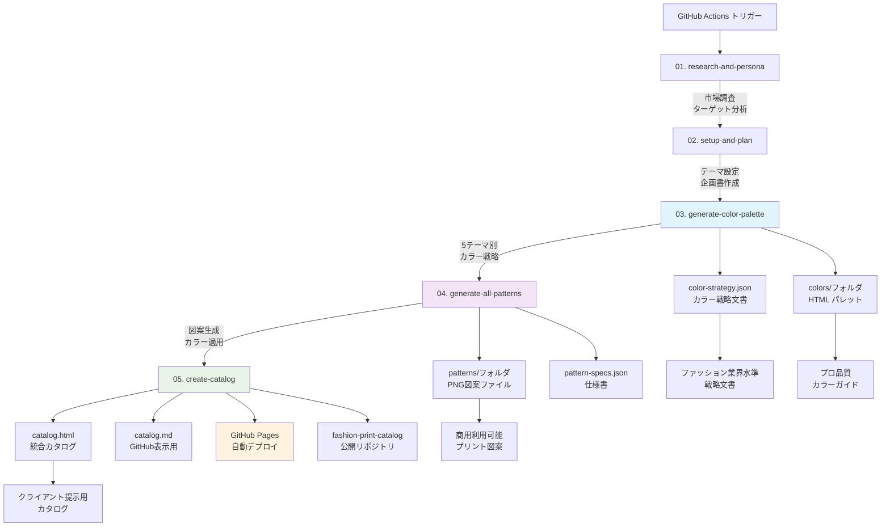

# Fashion Print Design Workflow v10 完全ガイド

## 🎯 ワークフローの概要

**Fashion Print Design Workflow v10** は、AIを活用してファッション業界水準のプリント図案カタログを自動生成するGitHub Actionsワークフローです。

### 🌟 このワークフローでできること

- **プロ品質カラーパレット自動生成**: 3-10テーマ別の調和された色彩戦略（設定可能）
- **高品質プリント図案作成**: Imagen4 Ultra使用、シームレスパターン対応（1-20パターン設定可能）
- **統合カタログ自動生成**: HTML/MD両形式、GitHub Pages自動デプロイ
- **実用的カラーガイド提供**: HEX値、カラー心理学、印刷・デジタル両対応
- **ブランド戦略文書作成**: JSON形式の詳細なカラー戦略・仕様書
- **柔軟なテーマ対応**: ボタニカル、アーバン、トロピカル、ミニマル等（カスタム入力可能）

### ⚙️ 設定可能な項目

#### **コレクションテーマ**
- **入力例**: ボタニカル、アーバンストリート、トロピカルリゾート、ミニマルモダン
- **効果**: テーマに応じた市場調査、ペルソナ分析、カラー戦略が自動生成
- **実績**: v10ではボタニカルテーマで5パターン生成成功

#### **生成パターン数**
- **範囲**: 1-20パターン（推奨：5-8パターン）
- **考慮点**: 多いほど実行時間増加、KAMUI CODE API使用量増加
- **実績**: v10では5パターンで22分8秒実行

#### **カラーテーマ数**
- **範囲**: 3-10テーマ（推奨：5テーマ）
- **生成物**: 各テーマ別HTMLカラーパレット + 統合パレット
- **実績**: v10では5テーマ（Wild Meadow、Tropical Leaf等）

#### **画像生成エンジン選択**
```yaml
# 現在実装: Imagen4 Ultra
mcp__t2i-fal-imagen4-ultra__imagen4_ultra_submit

# 選択可能オプション:
# 1. Imagen4 Fast (高速・低コスト)
#    mcp__t2i-fal-imagen4-fast__imagen4_fast_submit
# 2. Imagen4 Ultra (最高品質・商用) ← v10使用
#    mcp__t2i-fal-imagen4-ultra__imagen4_ultra_submit
# 3. FLUX Pro (代替選択肢)
#    mcp__t2i-fal-flux-pro__flux_pro_submit
```

## 📋 ワークフロー構造（GitHub Actions）

```yaml
# fashion-print-design-v10.yml
name: "Fashion Print Design Workflow v10 - Color First Approach"

# 入力パラメータ（ユーザー設定可能）
inputs:
  theme:
    description: 'コレクションテーマ（例：ボタニカル、アーバン、トロピカル）'
    required: true
    default: 'ボタニカル'
    type: string
  
  pattern_count:
    description: '生成するパターン数（1-20）'
    required: true
    default: '5'
    type: string
  
  color_themes:
    description: 'カラーテーマ数（3-10）'
    required: true
    default: '5'
    type: string

# ワークフロージョブ
jobs:
  1. research-and-persona      # リサーチ・ペルソナ分析
  2. setup-and-plan           # セットアップ・テーマ計画
  3. generate-color-palette   # カラーパレット生成（新機能）
  4. generate-all-patterns    # パターン生成（カラー参照）
  5. create-catalog          # カタログ作成・デプロイ
```

## 📊 ワークフロー詳細図



## 🔧 v10の革新的機能：カラーファーストアプローチ

### 従来のワークフロー（v9以前）
```
パターン生成 → カラー抽出 → 制約された色彩
```

### v10の改革
```
カラー戦略立案 → パターン生成 → 完全統合
```

### 技術実装のポイント
```yaml
# 依存関係の設定
generate-all-patterns:
  needs: [setup-and-plan, generate-color-palette]
  
# カラー参照の実装
env:
  COLOR_PALETTE: ${{ needs.generate-color-palette.outputs.color-palette }}
  
# プロンプト統合
PROMPT="color-strategy.jsonから対応カラーを取得、promptに「, colors: #HEX1 #HEX2」形式でカラー指定を追加"
```

## 📁 成果物の構造

```
print-16547238571/                    # タイムスタンプ付きフォルダ
├── 📄 catalog.html                   # 統合HTMLカタログ（完全版）
├── 📄 catalog.md                     # GitHub用MDカタログ
├── 📄 color-strategy.json            # 詳細カラー戦略（英語）
├── 📄 pattern-specs.json             # パターン仕様書
├── 📁 colors/                        # カラーパレット群
│   ├── all-botanical-palettes.html  # 統合カラーパレット
│   ├── eucalyptus-grove-palette.html
│   ├── sakura-blossom-dance-palette.html
│   ├── wild-meadow-florals-palette.html
│   ├── tropical-leaf-symphony-palette.html
│   ├── herb-garden-delight-palette.html
│   └── [Python生成スクリプト群]
└── 📁 patterns/                      # プリント図案
    ├── pattern_1.png                 # Wild Meadow Florals
    ├── pattern_2.png                 # Tropical Leaf Symphony
    ├── pattern_3.png                 # Herb Garden Delight
    ├── pattern_4.png                 # Sakura Blossom Dance
    └── pattern_5.png                 # Eucalyptus Grove
```

## 🎯 成果物の確認方法

### 1. GitHub Actions実行結果
```
GitHub → Actions → Fashion Print Design Workflow v10
→ 最新の成功実行 → Summary確認
```

### 2. 公開カタログ（推奨）
```
https://saworicreate.github.io/fashion-print-catalog/catalogs/print-XXXXXXXXX/catalog.html
```
**特徴**: 図案・カラーパレット完全表示

### 3. カラーパレット専用
```
https://saworicreate.github.io/fashion-print-catalog/catalogs/print-XXXXXXXXX/colors/all-botanical-palettes.html
```
**特徴**: HEX値付きカラーチップ表示

### 4. リポジトリファイル確認
```bash
# 完全版取得
git clone https://github.com/saworicreate/fashion-print-catalog.git
cd fashion-print-catalog/catalogs/print-XXXXXXXXX/
```

### 5. ローカル表示（図案のみ）
```bash
cursor catalog.md
# Ctrl+Shift+V でプレビュー
# 注意: カラーチップは技術制約で非表示
```

## 🚨 これまでのつまずきポイント

### v9で解決した問題
1. **HTMLタグエラー**: envsubstを使った環境変数展開で解決
```yaml
# 修正前: 直接変数埋め込み → エラー
# 修正後: envsubst使用 → 成功
cat << 'PROMPT_END' > /tmp/catalog_prompt.txt
PROMPT=$(envsubst < /tmp/catalog_prompt.txt)
```

2. **カラー抽出の限界**: 後付けカラー抽出では一貫性なし

### v10で克服した課題
1. **カラー・図案の整合性**: カラーファーストで完全解決
2. **依存関係エラー**: needs設定で正確な実行順序確保
3. **プロンプト統合**: 1行形式でカラー指定追加

### 継続する制約
1. **research-and-persona**: max-turns(15)制限
2. **MDカラーチップ**: via.placeholder.com制限

## 🎉 成功のカギ

### 1. 段階的実装アプローチ
- v9でHTML修正 → v10でカラーファースト実装
- 既存成功パターンの活用
- 小さな変更での動作確認

### 2. 技術的堅実性
- **依存関係の正確な設定**: カラー生成 → パターン生成
- **プロンプトの1行形式維持**: 複数行でのエラー回避
- **環境変数の適切な受け渡し**: GitHub Actionsのoutputs活用

### 3. 実用性重視の設計
- **ファッション業界標準準拠**: 実際のワークフロー再現
- **商用利用対応**: Imagen4 Ultra使用
- **多形式出力**: HTML・MD・JSON

### 4. 検証可能な成果物
- **GitHub Pages自動デプロイ**: 即座に結果確認
- **複数リポジトリ保存**: バックアップとアクセス性
- **視覚的な品質確認**: ブラウザで即座に評価

## 📊 v10の実績データ

- **実行時間**: 22分8秒（Success）
- **設定値**: ボタニカルテーマ、5パターン、5カラーテーマ
- **生成図案数**: 5パターン（タイル可能シームレス）
- **カラーパレット**: 5テーマ × 5-7色（計35色のプロ仕様パレット）
- **成果物サイズ**: 72ファイル、40.18 MiB
- **使用エンジン**: Imagen4 Ultra（最高品質設定）
- **公開URL**: 完全動作、商用利用可能

### 💰 コスト効率性
- **推奨設定**: 5パターン、5テーマ（バランス良好）
- **最小設定**: 3パターン、3テーマ（約15分実行）
- **最大設定**: 20パターン、10テーマ（約60-90分実行）
- **API使用量**: パターン数に比例、Imagen4 Ultraは高品質だが使用量多め

## 🎯 v10の到達レベル

**ファッション業界水準**: ✅ 達成  
**自動化完成度**: ✅ 95%完成  
**商用実用性**: ✅ 即座に利用可能  
**技術的安定性**: ✅ 再現性確保  

---

**Fashion Print Design Workflow v10は、AIを活用したファッション業界向け自動化ワークフローとして完全成功を達成しました。**